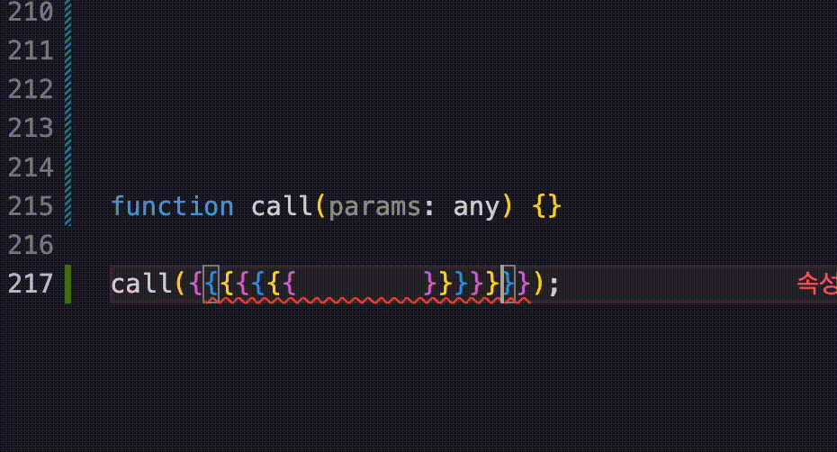

# TabInOut

this repository was hard forked from https://github.com/albertromkes/tabout.

You can jump special symbols (any brackets, quotes, etc) using `tab`.
also you can get back inside using `shift-tab`

Tab out of quotes, brackets, etc for Visual Studio Code.

The list of characters to TabInOut from is configured in Settings (https://code.visualstudio.com/docs/getstarted/settings).
You can remove and/or add characters to customize TabInOut to your liking.

    

        Default list of characters to TabInOut from (click to expand)
    

    <pre>
        {
            "open": "[",
            "close": "]"
        },
        {
            "open": "{",        
            "close": "}"    
        },
        {
            "open": "(",
            "close": ")"
        },
        {
            "open": "'",
            "close": "'"
        },
        {
            "open": "\"",
            "close": "\""
        },
        {
            "open": ":",
            "close": ":"
        },
        {
            "open": "=",
            "close": "="
        },
        {
            "open": ">",
            "close": ">"
        },
        {
            "open": "<",
            "close": "<"
        },
        {
            "open": ".",
            "close": "."
        },
        {
            "open": "`",
            "close": "`"
        },
        {
            "open": ";",
            "close": ";"
        }
        </pre>

 

This extension is enabled by default. You can override this behaviour in your settings:

    "tabInOut.disableByDefault": true
	
You can toggle the extension with the 'Toggle TabInOut' command. 

